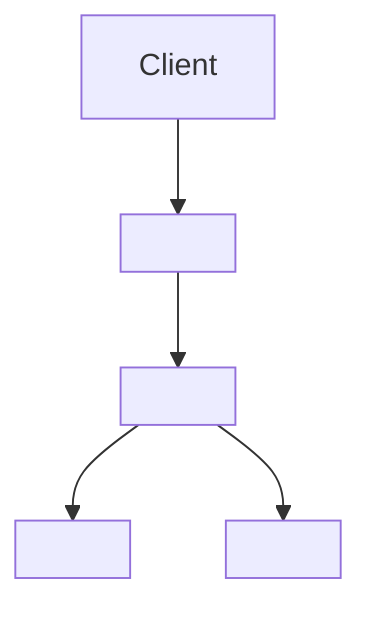

# <Design Document Title>

## 1. Summary

<!--
Explain in 3 to 6 sentences what problem this design document solves and the
core direction of the proposed design.

This is not an implementation plan.
Do not write "step 1 create the service, step 2 add the controller."
Write how the system will be designed, which boundaries must be maintained,
and which decisions matter.
-->

Example:

This document describes the design of <feature/system>. The design introduces
<main approach> to solve <problem>. The main goals are <goal A>, <goal B>, and
<goal C>. The design intentionally avoids <non-goal or constraint>.

---

## 2. Scope

<!--
What does this document cover?
After reading it, what system behavior or architecture boundaries should an AI
Agent and engineer understand?
-->

This document covers:

- <scope item 1>
- <scope item 2>
- <scope item 3>

---

## 3. Non-Scope

<!--
What does this document not cover?
This matters because it prevents an AI Agent from adding unrelated requirements
to the design.
-->

This document does not cover:

- <non-scope item 1>
- <non-scope item 2>
- <non-scope item 3>

---

## 4. Background / Current State

<!--
Describe the current system state, pain points, constraints, and known issues.

This may include:
- Existing architecture
- Current flow
- Current bug, scalability, or maintenance problems
- Why the existing design is insufficient
-->

Current state:

- <current state item 1>
- <current state item 2>
- <current state item 3>

Known problems:

- <problem 1>
- <problem 2>
- <problem 3>

Relevant existing code:

- `<path>`
- `<path>`
- `<path>`

---

## 5. Goals

<!--
Describe how design success will be judged.
Goals should be system outcomes, not task lists.
-->

This design should achieve:

- <goal 1>
- <goal 2>
- <goal 3>

---

## 6. Non-Goals

<!--
What is explicitly not being solved this time?
This prevents scope creep and keeps AI Agents from over-implementing.
-->

This design intentionally does not attempt to:

- <non-goal 1>
- <non-goal 2>
- <non-goal 3>

---

## 7. Proposed Design

<!--
This is the most important section of the document.
Describe the design currently being proposed.

Start with high-level architecture before entering code-level details.
-->

### 7.1 High-Level Architecture

<!--
Describe the main components, responsibility split, and interactions.
A Mermaid diagram can be useful here.
-->



High-level flow:

1. <step 1>
2. <step 2>
3. <step 3>

---

### 7.2 Component Responsibilities

<!--
Define what each component is responsible for and what it must not do.
This is especially important for AI Agents because it prevents logic from being
placed in the wrong layer.
-->

#### `<ModuleName>`

Responsibilities:

- <responsibility 1>
- <responsibility 2>

Must not:

- <thing this module must not do>

#### `<ServiceName>`

Responsibilities:

- <responsibility 1>
- <responsibility 2>

Must not:

- <thing this service must not do>

#### `<RepositoryName>`

Responsibilities:

- <responsibility 1>
- <responsibility 2>

Must not:

- <thing this repository must not do>

---

### 7.3 Data Flow

<!--
Describe the core flow.
For an API, this can follow a request from entry point to response.
For an event-driven design, this can follow an event from source to consumer.
-->

```text
<Request / Event / Command>
  -> <Controller / Consumer>
  -> <Application Service>
  -> <Domain Service>
  -> <Repository / External API>
  -> <Response / Event / State Change>
```

Detailed flow:

1. <flow step 1>
2. <flow step 2>
3. <flow step 3>

---

### 7.4 API / Contract Changes

<!--
If there are no API or contract changes, write:
No API or external contract changes.

If there are changes, describe the request, response, event schema, and error
behavior. Do not paste a full OpenAPI schema here; include only the key
contract.
-->

#### Endpoint: `<METHOD> <path>`

Request:

```json
{
  "example": "request"
}
```

Response:

```json
{
  "example": "response"
}
```

Error cases:

| Case | Status / Behavior | Notes |
|---|---:|---|
| `<case>` | `<status>` | `<notes>` |

---

### 7.5 Data Model / Persistence Changes

<!--
If there are no data model changes, write:
No data model or persistence changes.

If there are changes, describe the conceptual model, migration, indexes, and
constraints. Do not paste a full migration here; handle implementation details
in the implementation plan or migration file.
-->

Data model changes:

- <change 1>
- <change 2>

Migration considerations:

- <consideration 1>
- <consideration 2>

Indexes / constraints:

- <index or constraint 1>
- <index or constraint 2>

---

### 7.6 Configuration / Environment Changes

<!--
If there are no configuration changes, write:
No configuration or environment changes.
-->

New or changed configuration:

| Name | Required | Default | Description |
|---|---:|---|---|
| `<CONFIG_NAME>` | yes/no | `<value>` | `<description>` |

---

## 8. Design Decisions

<!--
Record the main decisions in this design document.
If a decision has large impact or is likely to be revisited, create a separate
ADR.
-->

### Decision 1: <decision title>

Decision:

- <what was decided>

Rationale:

- <why this decision was made>

Consequences:

- Positive:
  - <positive consequence>
- Negative:
  - <negative consequence>
- Neutral / trade-off:
  - <trade-off>

Related ADR:

- `<adr-id>` or `N/A`

---

## 9. Alternatives Considered

<!--
Record options that were considered but not chosen.
This is important for future AI Agents because it prevents them from repeatedly
proposing designs that were already rejected.
-->

### Alternative A: <alternative name>

Description:

- <description>

Pros:

- <pro 1>
- <pro 2>

Cons:

- <con 1>
- <con 2>

Reason not chosen:

- <reason>

### Alternative B: <alternative name>

Description:

- <description>

Pros:

- <pro 1>
- <pro 2>

Cons:

- <con 1>
- <con 2>

Reason not chosen:

- <reason>

---

## 10. Invariants

<!--
This is important AI Agent context.
Write the conditions the system must always maintain.

Examples:
- Refresh tokens must be single-use.
- A revoked session must never be accepted as authenticated.
- A completed payment must not be charged twice.
-->

The system must maintain the following invariants:

- <invariant 1>
- <invariant 2>
- <invariant 3>

---

## 11. Error Handling

<!--
Describe error scenarios and expected behavior.
This prevents bug fixes from creating inconsistent error behavior.
-->

| Scenario | Expected Behavior | Notes |
|---|---|---|
| `<scenario>` | `<behavior>` | `<notes>` |
| `<scenario>` | `<behavior>` | `<notes>` |

---

## 12. Security / Privacy Considerations

<!--
If this is not applicable, write:
No additional security or privacy considerations.

For auth, permissions, PII, payment, LLM prompts, and data retention, this
section should usually be included.
-->

Security considerations:

- <security consideration 1>
- <security consideration 2>

Privacy considerations:

- <privacy consideration 1>
- <privacy consideration 2>

Abuse / misuse cases:

- <abuse case 1>
- <abuse case 2>

---

## 13. Observability

<!--
Describe logs, metrics, traces, and alerts.
For agentic or LLM systems, consider token usage, latency, provider errors,
retries, and fallbacks.
-->

Logs:

- <log event 1>
- <log event 2>

Metrics:

- <metric 1>
- <metric 2>

Traces:

- <trace span 1>
- <trace span 2>

Alerts:

- <alert 1>
- <alert 2>

---

## 14. Testing Strategy

<!--
This is not a full test case list. Describe the testing strategy.
Concrete test cases can go in the implementation plan.
-->

Unit tests:

- <unit test area 1>
- <unit test area 2>

Integration tests:

- <integration test area 1>
- <integration test area 2>

E2E tests:

- <e2e test area 1>
- <e2e test area 2>

Regression tests:

- <regression case 1>
- <regression case 2>

---

## 15. Rollout / Migration Plan

<!--
For a small internal change, write:
No rollout or migration plan required.

If the design involves migration, feature flags, backward compatibility, or
provider switching, describe it clearly.
-->

Rollout strategy:

- <rollout step 1>
- <rollout step 2>

Backward compatibility:

- <compatibility note>

Feature flags:

- `<flag name>`: <purpose>

Migration:

- <migration step 1>
- <migration step 2>

Rollback strategy:

- <rollback step 1>
- <rollback step 2>

---

## 16. Risks and Mitigations

<!--
List major risks and mitigations.
-->

| Risk | Impact | Mitigation |
|---|---|---|
| `<risk>` | `<impact>` | `<mitigation>` |
| `<risk>` | `<impact>` | `<mitigation>` |

---

## 17. Open Questions

<!--
List unresolved questions.
Each open question should ideally have an owner.
-->

| Question | Owner | Status |
|---|---|---|
| `<question>` | `<owner>` | open |
| `<question>` | `<owner>` | open |

---

## 18. Design Drift Notes

<!--
Record which later code changes may require this design document to be updated.
This is not a revision history. It is a reminder for future reviewers and AI
Agents to re-check drift-sensitive areas.
-->

Drift-sensitive areas:

- <area 1>
- <area 2>
- <area 3>

When changing the following code paths, re-check this design document:

- `<path>`
- `<path>`

---

## 19. Related Documents

Design documents:

- `<design-doc-id>`

ADRs:

- `<adr-id>`

Implementation plans:

- `<implementation-plan-id>`

Runbooks:

- `<runbook-id>`

---

## 20. Revision History

<!--
Git history is the primary source. Only record important design changes here.
Do not log every small PR.
-->

| Date | Change | PR / Commit |
|---|---|---|
| YYYY-MM-DD | Initial version | `<PR or commit>` |